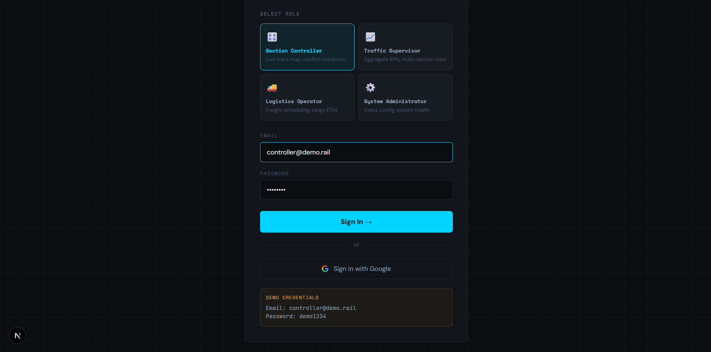
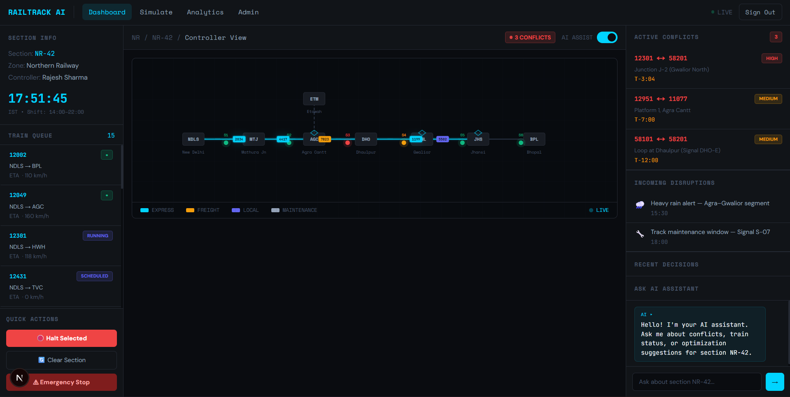
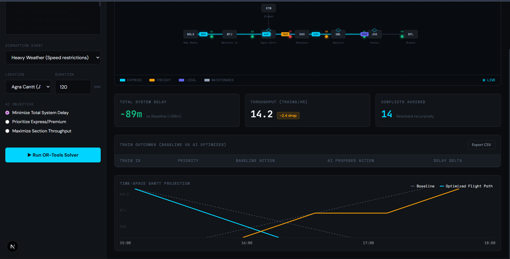
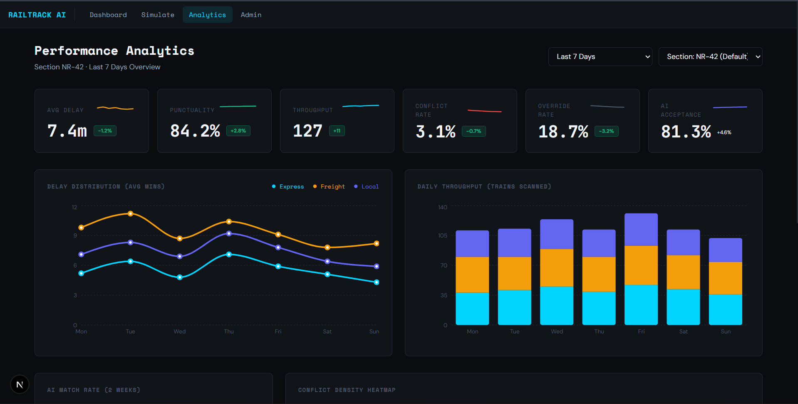

<div align="center">
  <h1>RailTrack AI</h1>
  <p><em>AI-powered railway traffic decision support system for Indian Railways section controllers. Built with OR-Tools CP-SAT, FastAPI, and Next.js.</em></p>

  [](https://railtrack-ai-ntlv.vercel.app)
  []()
  [](https://opensource.org/licenses/MIT)
  []()
</div>

AI-powered railway traffic decision support system for Indian Railways section controllers. Built with **OR-Tools CP-SAT**, **FastAPI**, and **Next.js**.

---

## Screenshots

<div align="center">
  <figure>
    
    <figcaption>Role-based login with Google OAuth</figcaption>
  </figure>
  <br/>
  <figure>
    
    <figcaption>Live controller dashboard with real-time train map</figcaption>
  </figure>
  <br/>
  <figure>
    
    <figcaption>OR-Tools CP-SAT conflict resolution results</figcaption>
  </figure>
  <br/>
  <figure>
    
    <figcaption>Performance analytics dashboard</figcaption>
  </figure>
</div>

---

## What's New in v2.0.0

| Patch | Change |
|---|---|
| P1 | Fixed 401 auth gate on `/simulate` and `/analytics` — `isAuthReady` guard prevents API calls before JWT hydration |
| P2 | WebSocket telemetry upgraded from mock random data → real IRCTC RapidAPI live positions with per-train 60s cache |
| P3 | Dashboard sidebar shows live delay, current station and colored status dot inline after Fetch |
| P4 | Simulate page: dynamic location + train dropdowns from DB, fixed POST payload schema, OR-Tools results panel |
| P5 | Analytics page: functional period/section dropdowns, KPI deltas computed from sparklines, flat-data notice |
| P6 | Real-time conflict detection: RUNNING train pairs auto-detected → ephemeral RT- conflicts merged with DB conflicts |
| P7 | AI Assistant grounded in live context: active conflicts, running trains, recent decisions injected every message |
| P8 | UI/UX polish: mobile sidebar toggle, loading skeletons, error boundaries, chart warnings fixed, reset clears results |
| P9 | Admin page: System Health with colored dots + refresh, Invite User modal, Edit user form, status toggle |
| P10 | Performance: RapidAPI exponential backoff + circuit breaker, WebSocket reconnect with amber state, React Query staleTime, DB connection pooling |

---

## Features

<table width="100%">
  <tr>
    <td width="33%">🚆 Real-time train tracking on NR-42 corridor</td>
    <td width="33%">🤖 AI conflict detection & resolution</td>
    <td width="33%">⚡ <b>Google OR-Tools CP-SAT v9.x</b> precedence optimization</td>
  </tr>
  <tr>
    <td width="33%">📊 Performance analytics & KPI dashboards</td>
    <td width="33%">👥 Role-based access (Admin/Controller/Supervisor/Logistics)</td>
    <td width="33%">🔐 <b>JWT</b> auth + <b>Google OAuth</b></td>
  </tr>
  <tr>
    <td width="33%">📧 Email invite system (<b>Resend API</b>)</td>
    <td width="33%">🏥 Real-time system health monitoring</td>
    <td width="33%">🔌 IRCTC live train data integration</td>
  </tr>
  <tr>
    <td width="33%">📡 WebSocket live telemetry</td>
    <td width="33%">🚫 403 guard for non-admin routes</td>
    <td width="33%">🌐 Production deployed (<b>Vercel</b> + <b>Railway</b>)</td>
  </tr>
</table>

---

## Architecture Diagram

```ascii
Browser (Next.js) ──── REST + WebSocket ────► FastAPI (Python 3.11)
                                                   │        │        │
                                              PostgreSQL  OR-Tools  Groq
                                              (Railway)  CP-SAT    Llama 3
                                                   │
                                              IRCTC RapidAPI
                                              Resend Email API
```

---

## Demo Credentials

> **Note**: Test the live application at [https://railtrack-ai-ntlv.vercel.app](https://railtrack-ai-ntlv.vercel.app). Use the credentials below to explore different dashboards.
> 
> | Role | Email | Password | Access Description |
> |------|-------|----------|--------------------|
> | Admin | admin@demo.rail | demo1234 | Full system configuration and user management. |
> | Controller | controller@demo.rail | demo1234 | Traffic monitoring and AI conflict resolution. |
> | Supervisor | supervisor@demo.rail | demo1234 | System analytics and high-level reports. |
> | Logistics | logistics@demo.rail | demo1234 | Freight scheduling and delayed train tracking. |
> | Guest | guest@demo.rail | demo1234 | Read-only access to select dashboards. |

---

## Quick Start

<details>
<summary><b>Click to expand local setup instructions</b></summary>

### Prerequisites

- Node.js (for **TypeScript**, **TailwindCSS**, **TanStack Query**, **NextAuth.js v4** frontend)
- **Python 3.11** (for backend)
- **PostgreSQL** database

### 1. Backend Setup

```bash
cd backend
python -m venv venv
source venv/bin/activate  # On Windows: venv\Scripts\activate

# Install requirements including SQLAlchemy async and asyncpg
pip install -r requirements.txt
cp .env.example .env

# Run database migrations
alembic upgrade head

# Start FastAPI server
uvicorn app.main:app --reload
```

### 2. Frontend Setup

```bash
cd railtrack-ai
npm install

cp .env.example .env.local

# Start Next.js development server
npm run dev
```

</details>

---

## API Reference

API Documentation: [https://railtrack-ai-production.up.railway.app/docs](https://railtrack-ai-production.up.railway.app/docs)

| Method | Path | Auth Required | Description |
|--------|------|---------------|-------------|
| `POST` | `/api/auth/login` | No | Authenticate user and issue **bcrypt**-hashed JWT |
| `GET`  | `/api/trains/live` | Yes | Retrieve real-time train positions from IRCTC |
| `POST` | `/api/solver/run` | Yes (Controller) | Execute Google OR-Tools CP-SAT resolution |
| `GET`  | `/api/analytics/kpi` | Yes (Admin/Supervisor) | Fetch performance analytics data |
| `GET`  | `/ws/telemetry` | Token in query | WebSocket endpoint for live map updates |

---

## Deployment

- **Vercel** (Frontend): [https://railtrack-ai-ntlv.vercel.app](https://railtrack-ai-ntlv.vercel.app)
- **Railway** (Backend API + DB): [https://railtrack-ai-production.up.railway.app/docs](https://railtrack-ai-production.up.railway.app/docs)

---

## What Makes This Different

- **Complex CP-SAT Solver Integration:** Modeling railway preemption and scheduling using a strict constraint-programming approach is mathematically rigorous and non-trivial compared to standard CRUD applications.
- **Asynchronous FastAPI + PostgreSQL:** Fully async Python backend utilizing `asyncpg` combined with SQLAlchemy async ensures high concurrency when processing real-time WebSocket telemetry and computationally heavy solver results.
- **Three-Layer Role-Based Auth:** A robust security model that seamlessly mixes standard NextAuth.js on the edge, custom JWT validation in FastAPI middlewares, and granular row-level and route-level authorization restrictions.
- **Live AI Assistant with Real-Time Context:** Unlike static chatbots, the AI assistant receives a fresh system prompt on every message containing actual conflict IDs, running train names, delays, and recent controller decisions — making it genuinely context-aware rather than hallucinating.
- **Real-Time Conflict Engine:** Auto-detects crossing conflicts by grouping RUNNING trains by section and generating ephemeral RT- conflict pairs — no manual seeding required. Severity is inferred from train priority (EXPRESS pair = HIGH).

---

## Built By

Built solo by Anudeep GRS as Team Lead for SIH 2024

---

## License

MIT

<div align="right">
  <a href="#railtrack-ai">Back to top</a>
</div>
